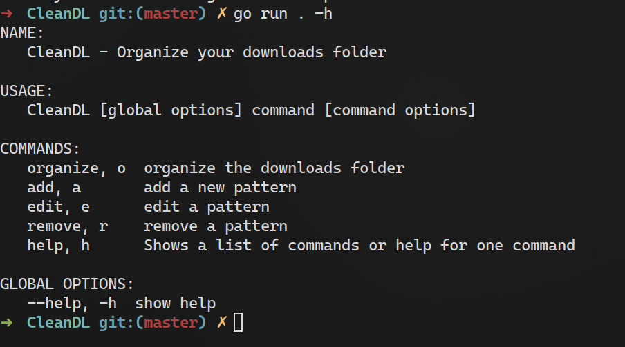

# CleanDL
A stunningly simple Golang CLI app to clean your Downloads folder on Windows!



It allows you to specify regex patterns and an "expiry" date. Then, it lets you choose whether to move the file to another location or delete it.

Personally, I found this extremely useful; i.e: move a `.pdf` file to my Documents folder after 30 days, because it's probably needed.

# Usage
To run the program, simply execute the binary.
```sh
./CleanDL
```
or, on Windows:
```pwsh
./CleanDL.exe
```

You can use `--help` for more information, or be guided interactively by just running the command above.

Please note that there are currently no precompiled binaries available. You will have to compile the program manually. The steps for this are available below.

# Compiling
Thanks to Go, compilation is made extremely easy!

All you have to do is run the following command:
```sh
go build .
```

It will automatically handle everything for you, and produce an executable in the current directory.